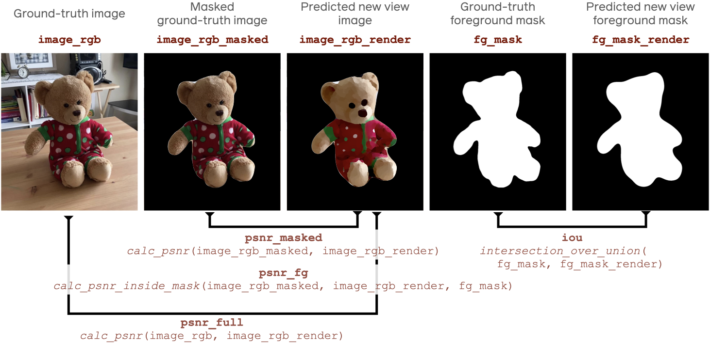

<center>

</center>


Common Objects in 3D Challenge
==============================

The following describes the Common Objects in 3D Challenge (CO3DC).

# Quick start
See example code for creating a CO3DC submission in:
```
<co3d_repository_root>/examples/example_co3d_challenge_submission.py
```
Note that the codebase also requires the latest PyTorch3D installation.

After running the evaluation code, please send the produced .hdf5 file to the
EvalAI evaluation server:

[===> CO3D challenge submission page  <===](https://eval.ai/web/challenges/challenge-page/1819/submission)

Note that submission using the `evalai` CLI interface is strongly encouraged.


# CO3D challenge overview

CO3D challenge evaluates New-view Synthesis methods.

More specifically, <b>given a set of known "source" views of an object, the goal
is to generate new, previously unobserved, "target" views of the scene</b>.

The challenge has 2 tracks - _Many-view_, and _Few-view_.

### _Many-view_ task

This is the standard scenario popularized by e.g. NeRF. Given many
(~100) known source views of a scene, the goal is to generate target views
that are relative close to the source ones.

### _Few-view_ task

Here, the goal is the same as in Many-view, with the difference that only
a very small number of source views is known (2-10). Methods are likely to succced
only if they exploit category-centric geometry/appearance prior that can be learned
from the category-centric training data.

### CO3Dv2 Dataset

The CO3Dv2 dataset provides all training and testing data needed for a submission.
Please follow the [main README](https://github.com/facebookresearch/co3d/tree/main#readme) file to downlaod and install the dataset.

### Evaluation data

Each evaluation example contains several source views and a single
target view. For each source view, the corresponding color image,
foreground segmentation mask, and camera parameters are given.
Given this information, the goal is to generate the target view, for which only the
camera parameters are given.

### Evaluation metrics

<h5><tt>PSNR_masked</tt> - The main evaluation metric</h5>
<p>
    The submissions are primarilly evaluated in terms of the color prediction accuracy
    measured by evaluation the Peak-signal-to-ratio metric (PSNR) between the predicted
    image and the ground truth image masked with the foreground mask (<tt>PSNR_masked</tt>).
</p>

<p>
    <b><tt>PSNR_masked</tt> - </b>
    Since we are interested only in reconstructing the objects in the
    foreground, the ground truth target view for <tt>PSNR_masked</tt> consists of the original
    ground truth image masked using a foreground mask to produce an image containing
    the object of interest with a black background. 
    <b>Note that this requires each submission to generate renders that only contain the
    foreground object with the background regions colored with <i>black</i> color</b>.
</p>

<h5>Additional image metrics - <tt>PSNR_fg</tt> and <tt>PSNR_full</tt></h5>
<p>
    Together with <tt>PSNR_masked</tt>, we also calculate <tt>PSNR_full</tt> and <tt>PSNR_fg</tt>. 
    PSNR_fg restricts the evaluation only to the foreground pixels as defined by the
    foreground segmentation mask.
    <tt>PSNR_full</tt> evaluates PSRN between the original unmasked image and the predicted one.
</p>

<h5>Mask metrics - <tt>IoU</tt></h5>
<p>
    Each submision is also required to generate the a binary mask denoting the
    regions of the image that are occupied by the object. The <tt>IoU</tt> evaluation metric
    then computes the Intersection-over-Union between the predicted foreground
    region and the ground truth foreground mask.
</p>

<h5>Depth metrics - <tt>depth_abs_fg</tt></h5>
<p>
    Finally, each submission should produce the render the depth render which comprises
    the z-component of each pixel's point location in the camera coordinates.
    The rendered depth is compared to the ground truth one using the absolute depth error
    metric. Note that the depth is computed only for the foreground pixels as defined
    by the ground truth segmentation mask.
</p>

<hr>

<p>
    <i>
    Note that if an evaluated method is not able to produce depth maps or segmentation
    masks, users are free to generate placeholder depth and mask predictions. Of course,
    this will lead to a low performance in <tt>depth_abs_fg</tt> or <tt>IoU</tt>.
    </i>
</p>

<p>
    The following image illustrates the <tt>PSNR</tt> and <tt>IoU</tt> metrics:<br>
    >
</p>


# CO3D challenge software framework
The `co3d` repository contains tooling that allow a simple generation and submission
of challenge entries.


## Submission guide
1) Install the `co3d` package:
    ```
    git clone https://github.com/facebookresearch/co3d
    cd co3d
    pip install -e .
    ```

2) Start by importing the `CO3DSubmission` class and instantiate a submission run.
    For example, the following code:
    ```python
    from co3d.challenge.co3d_submission import CO3DSubmission
    output_folder = "./co3d_submission_files"
    task = CO3DTask.MANY_VIEW
    sequence_set = CO3DSequenceSet.TEST
    
    submission = CO3DSubmission(
        task=task
        sequence_set=sequence_set,
        output_folder=output_folder,
        dataset_root=dataset_root,
    )
    ```
    will instantiate a CO3D submission object `submission` that stores (and optionally
    evaluates) results of the `manyview` task on the `test` set. All results will be
    stored in the `output_folder`. Note that a user has to also specify the local root
    folder of the CO3D dataset in `dataset_root`.

3) Obtain the dictionary of evaluation examples `eval_batches_map` from `submission`.
    ```python
    eval_batches_map = submission.get_eval_batches_map()
    ```
    here, `eval_batches_map` is a dictionary of the following form:
    ```
    {(category: str, subset_name: str): eval_batches}  # eval_batches_map
    ```
    where `eval_batches` look as follows:
    ```python
    [
        [
            (sequence_name_0: str, frame_number_0: int),
            (sequence_name_0: str, frame_number_1: int),
            ...
            (sequence_name_0: str, frame_number_M_0: int),
        ],
        ...
        [
            (sequence_name_N: str, frame_number_0: int),
            (sequence_name_N: str, frame_number_1: int),
            ...
            (sequence_name_N: str, frame_number_M_N: int),
        ]
    ]  # eval_batches
    ```
    Containing a list of `N` evaluation examples, each consisting of a tuple of 
    `M_i` frames with numbers `frame_number_j` from a given sequence name `sequence_name_i`.
    Note that the mapping between `frame_number` and `sequence_name` to the CO3D data
    is stored in the respective `frame_annotations.jgz` and `sequence_annotation.jgz`
    files in `<dataset_root>/<sequence_category>`.

    For the <b>Many-view task</b> (`CO3DTask.MANYVIEW`), each evaluation batch has a single
    (`M_i=1`) frame, which is the target evaluation frame.

    For the <b>Few-view task</b> (`CO3DTask.FEWVIEW`), each batch has several frames (`M_i>1`),
    where the first frame is the target frame which should be predicted given the knowledge
    of the source frames that correspondond oto the 2nd-to-last elements of each batch.


4) Next we iterate over eval_batches, predict new views, and store our predictions
with the `submission` object.
    ```python
    # iterate over evaluation subsets and categories
    for (category, subset_name), eval_batches in eval_batches_map.items():
        
        # iterate over all evaluation examples of a given category and subset
        for eval_batch in eval_batches:
            # parse the evaluation sequence name and target frame number from eval_batch
            sequence_name, frame_number = eval_batch[0][:2]
            
            # `predict_new_view` is a user-defined function which generates
            # the test view (corresponding to the first element of the eval batch)
            image, depth, mask = predict_new_view(eval_batch, ...)  
            
            # add the render to the submission
            submission.add_result(
                category=category,
                subset_name=subset_name,
                sequence_name=sequence_name,
                frame_number=frame_number,
                image=image,
                mask=mask,
                depth=depth,
            )
    ```

5) Finally, we export the submission object to a hdf5 file that can be uploaded to the
EvalAI server:
    ```
    submission.export_results()
    ```

6) Submit the resulting hdf5 file to the EvalAI submission server:

    There are two options for submission, with the first option strongly preferred:
    
    1. <b>(Preferred, please use this option) Submit the file using evalai command line interface:    
        1. Obtain your personal token from your EvalAI profile page:</b>
            
            Go to https://eval.ai/web/profile, then click on 'Get your Auth Token' button.
            Click on "Show Token" and copy-paste the revealed token.
        2. Set the environment variable EVAL_AI_PERSONAL_TOKEN to your personal token.
            ```bash
            export EVAL_AI_PERSONAL_TOKEN=<your_eval_ai_auth_token>
            ```
        3. Install EvalAI command line interface:
            ```bash
            pip install evalai
            ```
        4. Submit the results to the EvalAI evaluation server by calling the
            `submit_to_eval_ai()` of your CO3D `submission` object:
            ```python
            submission.submit_to_eval_ai()
            ```

    2. (Avoid this option if possible, use only if a) fails.) Submit the file using the EvalAI submission page.
        1. Visit the [===> CO3D challenge submission page <===](https://eval.ai/web/challenges/challenge-page/1819/submission)
        2. Submit the exported HDF5 file using the web interface.